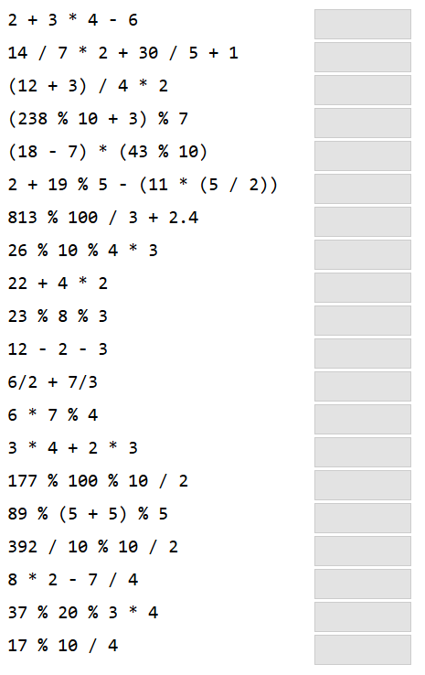
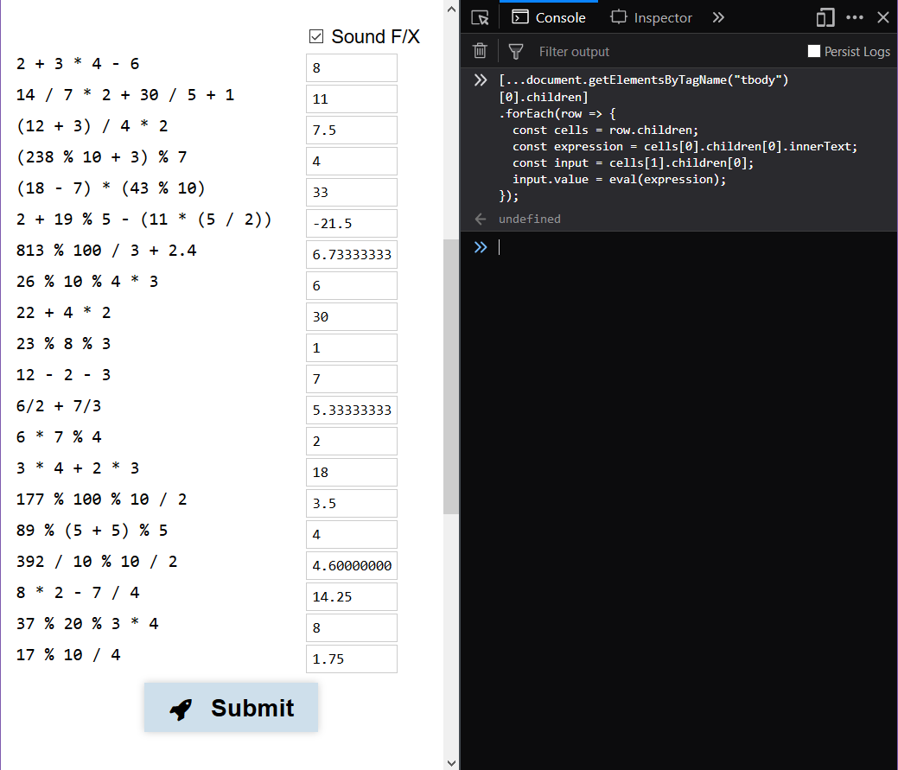
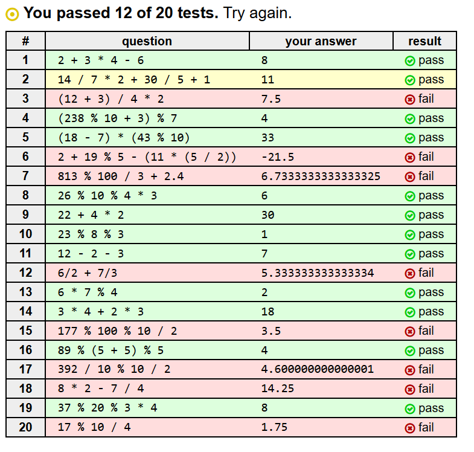
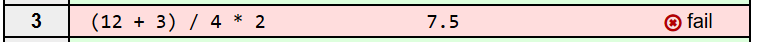
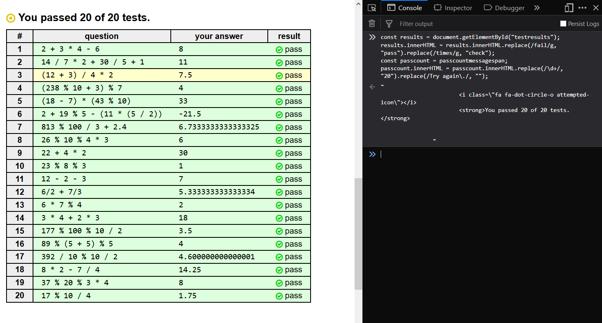
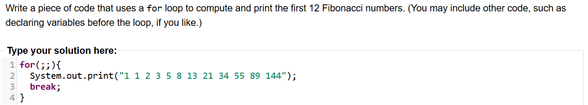
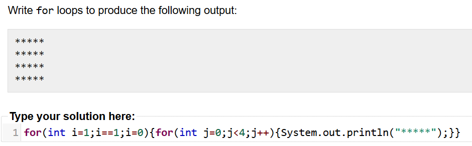
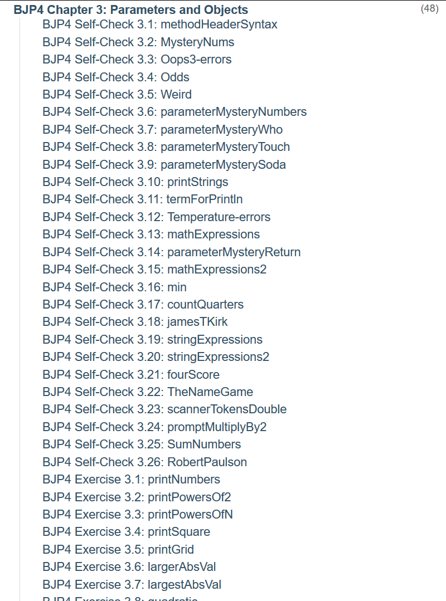
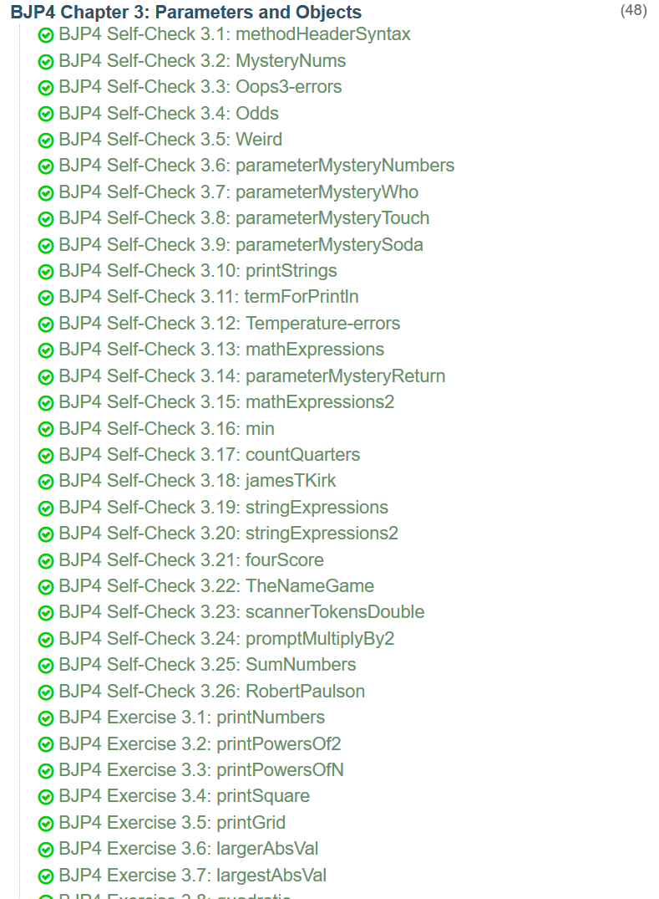

# Practice-It: Building Java Programs, 4th Edition

Most of this stuff was pretty basic so I tried to learn by purposely doing the problems in an unintended way.

## Chapter One

Most of these exercises were all about printing certain things.
Since that's boring and easy,

[writeCode.js](writeCode.js)

```javascript
// optimized for reading
writeCode = c =>
  console.log(
    "public class "
    + c
    + "{public static void main(String[] a){System.out.print("
    + JSON.stringify(document.getElementsByClassName('output')[0].innerText)
    + ");}}"
  );
```

to grab the output from the DOM
and stick it into a generic Java method.

## Chapter Two

This chapter was mostly about nested for-loops and how to use them.
Practice-It seemed to have a pretty competent code analyser so it could figure out if you followed instructions.
It tested to see if two for-loops were used and then tested the output.
[writeCode2.js](writeCode2.js) had to add two useless for-loops to trick Practice-It.

```javascript
console.log(
  `for(;;){for(;;){break;}break;}\nSystem.out.print(${
    JSON.stringify(document.getElementsByClassName('output')[0].innerText)}
  );`
);
```

The `console.log` and `JSON.stringify` are to properly escape backslashes.

As the problems became more complicated, [writeCode2.js](writeCode2.js) was no longer useful.


**Self-Check 2.3** was one of such problems:
> Trace the evaluation of the following expressions,
> and give their resulting values. Make sure to give
> a value of the appropriate type
> (such as including a .0 at the end of a double).



I wasn't going to evaluate all that by hand. That's boring and takes too long.
So to save time I spent a total of 10 minutes automating it. Spoiler: *It didn't save time*

[solveExpressions.js](solveExpressions.js)

```javascript
[...document.getElementsByTagName("tbody")[0].children].forEach(row => {
  const cells = row.children;
  const expression = cells[0].children[0].innerText;
  const input = cells[1].children[0];
  input.value = eval(expression);
});
```

So I ran it



It seemed good until



wait, what



What Practice-It thinks: `15 / 4 * 2 != 7.5`

What Practice-It Parses it as: `15 / (4 * 2)`

What's right: `(15 / 4) * 2`

That's dumb and I wasn't going to incorrect my code to correct my answer. I still had to send in a picture of my code though.
[passSC2.3.js](passSC2.3.js)

```javascript
testresults.innerHTML = testresults.innerHTML.replace(/fail/g, "pass").replace(/times/g, "check");
passcountmessagespan.innerHTML = passcountmessagespan.innerHTML.replace(/\d+/, "20").replace(/Try again\./, "");
```


It's not perfect, but it's convincing enough. The yellow bar is just from my cursor hovering over a row.

**Exercise 2.3** Didn't put up too much of a fight



Neither did **Exercise 2.4**


You don't even need nested for-loops for this

## Chapter Everything Else

Slava talked to me and suggested that I write something that "passes" everything.
I didn't really get it at first but then he told me that all I needed to submit was a picture of this page for each chapter that was due.



In the picture I had Chapter Three open, but this works for every chapter. I got to work coding:

[passAll.js](passAll.js)

```javascript
[...(d = document)[g = "getElementsByClassName"]("solvedproblemstatus")]
  .concat(
    [...d.querySelectorAll('img[src="/images/blank.gif"]')]
  )
  .map(
    n => n[p = 'parentNode'].removeChild(n)
  );

[...d[g]("problemlink")]
  .map((a, P) => {
    (P = a[p]).className = "solvedproblem";
    P.innerHTML = `<span class="solvedproblemstatus"><i class="fa fa-check-circle-o pass-icon"></i></span>${P.innerHTML}`
  });
```



Good work!
